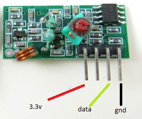
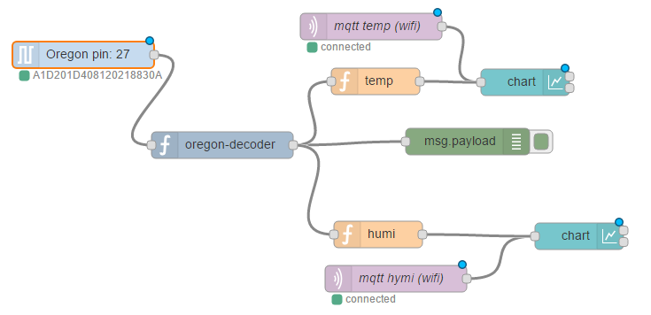

# node-red-contrib-oregon
[](https://badge.fury.io/js/node-red-contrib-oregon)

Oregon Scientific radio decoder and sensor [Node-RED](http://nodered.org/) nodes for Raspberry pi with RF433 module connected.

## Installation
Run the following command in the root directory of your Node-RED install

    npm install node-red-contrib-oregon
## Pre-requisites
You need to install [wiring-pi](https://www.npmjs.com/package/wiring-pi) before use oregonPi node. 
Refer to the Node-red documentation for details about [wiring-pi module](http://nodered.org/docs/hardware/raspberrypi).  

## Hardware

I used the following chip connected to my Raspberry pi 3:


 
I also made a small antenna to the chip using a piece of wire.

## Flow example

The following flow example demonstrates how to publish data on [charts](https://www.npmjs.com/package/node-red-dashboard) using oregon nodes (the data to charts also comes from mqtt nodes).

 
 
The **Oregon pin 27** is listening RF433 module which connected to Raspberry pi 27 pin [using GPIO pin numbering](http://wiringpi.com/pins/). 
It detects oregon protocol data and outputs it in hexadecimal representation in `msg.payload`. The details about radio data and message format can be obtained [here](http://wmrx00.sourceforge.net/Arduino/OregonScientific-RF-Protocols.pdf). 

The hexadecimal representation requires conversion to a human readable format. This is done by **oregon-decoder** node. It outputs the following fields in `msg.payload`:
 * `id` - oregon sensor type id
 * `sensorName` - oregon sensor name
 * `channel` - channel (1 - 3)
 * `rolling` - rolling code
 * `lowBattery` - low battery flag (`true` / `false`)
 * `data` - object with sensor data (depends on sensor type)

The actual `temperature` and `humidity` (if particular sensor outputs them) are passed in the `msg.payload.data` fields. Therefore they should be extracted from the "oregon-decoder" output.

On the flow example this is done by corresponding "temp" and "humi" function nodes. The temp function has the following code (for humidity replace `temperature` with `humidity`):
```javascript
var data = msg.payload;
return {topic: [data.sensorName, data.channel, data.rolling].join('/'), payload: data.data.temperature};
```

Now the functions outputs can be connected to the appropriate charts or other Node-red nodes.
